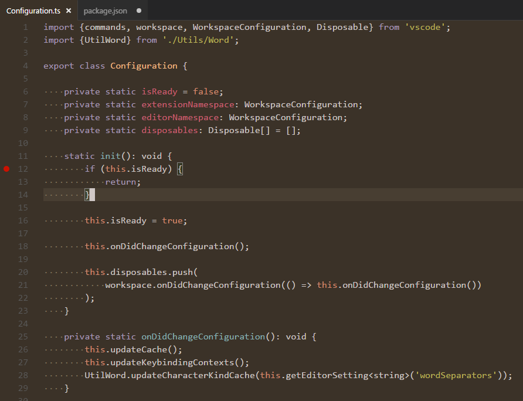
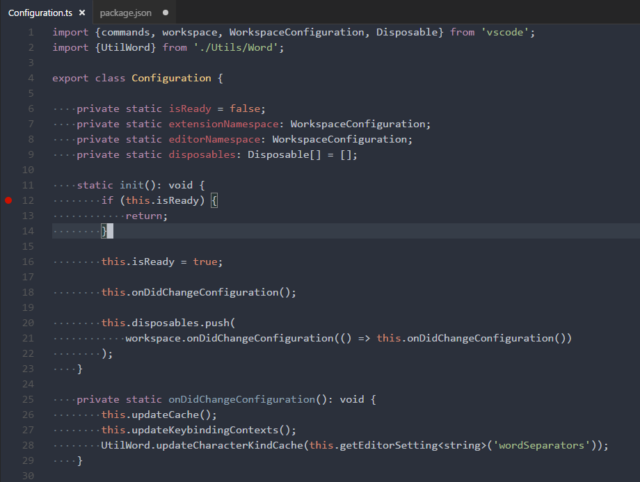
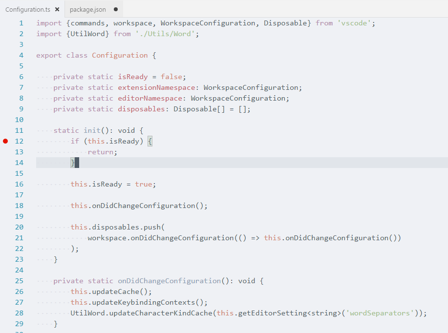

# Spacegray Theme for Visual Studio Code
Spacegray theme adapted for visual studio code.

## Base 16 Eighties

## Base 16 Mocha

## Base 16 Ocean Dark

## Base 16 Ocean Light

## How to activate
Open the command palette (Ctrl+Shift+P) and search for `Color Theme`.  
Search for `Spacegray` and select from the available options.

## Author
Mihai Ionut Vilcu
 
+ [github/ionutvmi](https://github.com/ionutvmi)
+ [twitter/ionutvmi](http://twitter.com/ionutvmi)

## Credits
This theme is based on the [Spacegray](https://github.com/kkga/spacegray) theme for sublime text.
